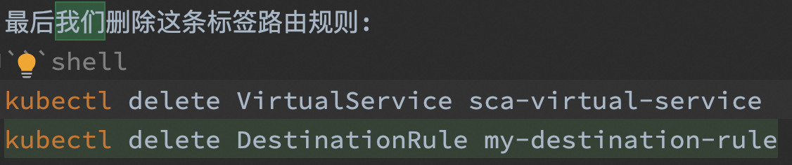
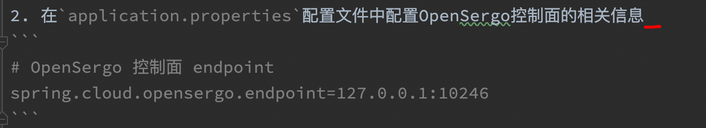
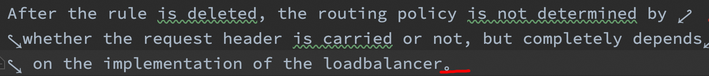
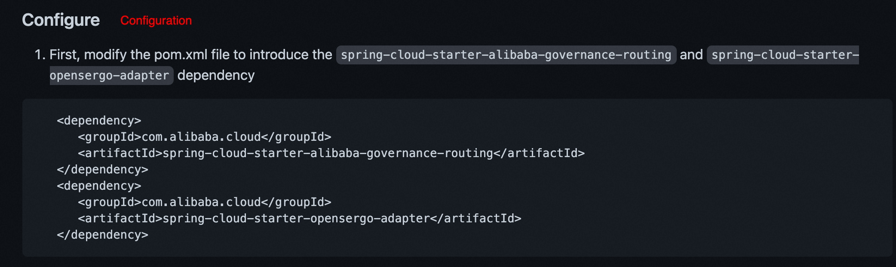
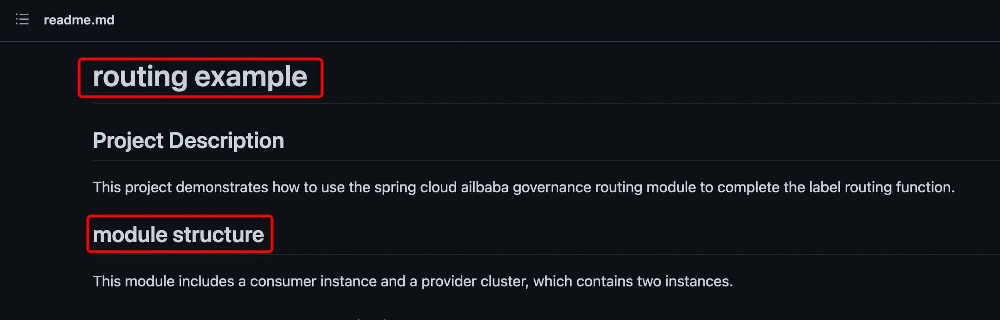
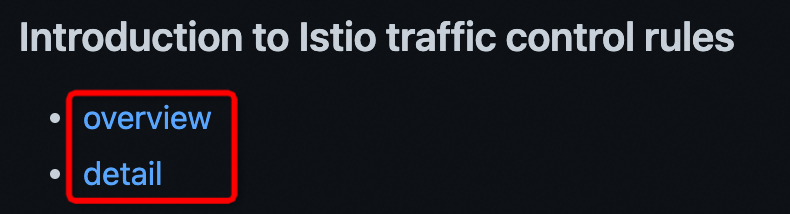
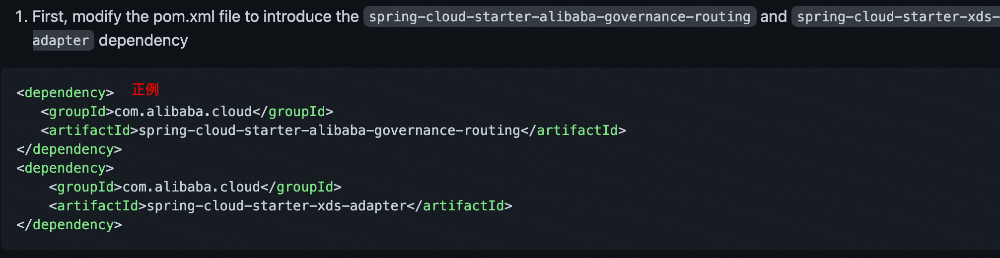
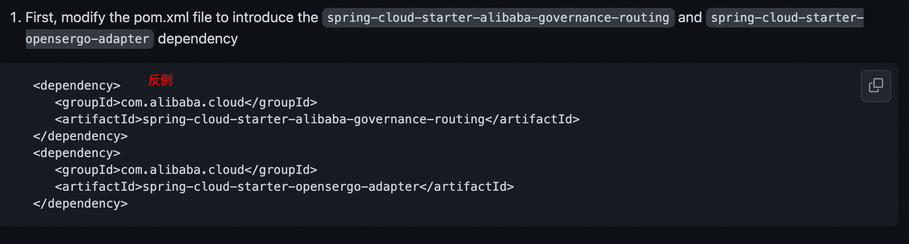
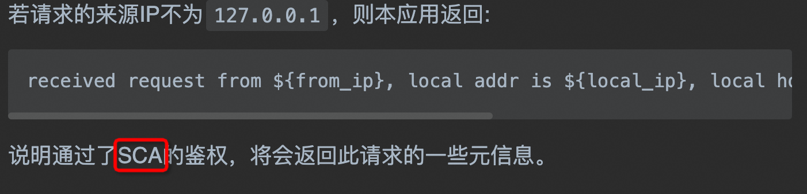
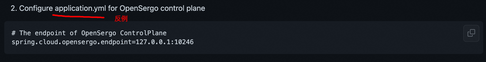

1. Do not use us, xxx, etc. in formal written documents:

2. After finishing one sentence, you need to add appropriate punctuation marks:

3. Pay attention to proper nouns, spring cloud->Spring Cloud, feign->Feign, nacos->Nacos, etc. If you don’t know the proper nouns, please search with relevant keywords in the search engine to see what the capitalization of the word is. Some words need to be written separately DestinationRule->Destination Rule. In addition, in English, you need to pay attention to the part of speech. Do not use verbs in the title, usually nouns:

4. Please capitalize the first letter of the module title in English:

5. Modifier, different content needs to adapt to the corresponding type:

6. It is better to declare abbreviations before using them as much as possible, such as Spring Cloud Alibaba (hereinafter referred to as SCA). Do not just use some abbreviations that outsiders are not familiar with without saying anything:

7. Key content, such as specific configuration files and dependency names, need to be marked with shadows:

8. A few questions need to be answered. What is the scope of your function, that is, how far has it been achieved?

9. Which steps are easy for users to make mistakes when using your function? Should they be reminded in advance?

10. Finally, read it at least once after you finish writing, otherwise there is a high probability that there will be problems! Otherwise, there is a high probability that there will be a problem! Otherwise, there is a high probability that there will be a problem!
