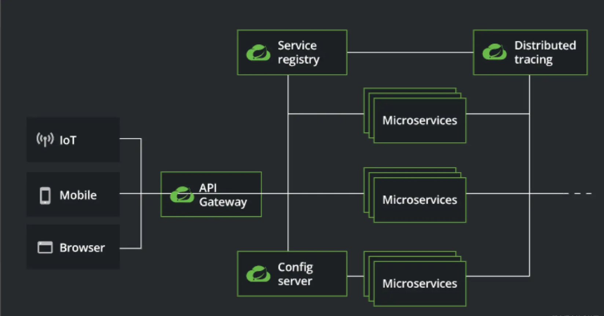

Spring Cloud Alibaba is dedicated to providing a one-stop solution for micro-service development. This project contains the components necessary to develop distributed application services, making it easy for developers to use these components to develop distributed application services through the Spring Cloud programming model.

Relying on Spring Cloud Alibaba, you only need to add some annotations and a little configuration, you can connect Spring Cloud applications to Ali distributed application solutions, and quickly build distributed application systems through Ali middleware.

In addition, Ali Cloud also provides [Spring Cloud Alibaba enterprise version micro-service solutions](https://www.aliyun.com/product/aliware/mse?spm=sca-website.topbar.0.0.0) micro-service solutions, including non-intrusive service governance (full link gray scale, lossless up and down line, outlier instance removal, etc.), enterprise Nacos registration and configuration center, enterprise cloud native gateway and many other products.

# Spring Cloud microservice system

Spring Cloud is a one-stop solution for distributed microservices architecture, providing an easy-to-use programming model that makes it easy to build microservices on top of Spring Boot.
**Spring Cloud provides standards for building distributed systems with microservices at the core. **

Spring Cloud itself is not an out-of-the-box framework; it is a set of microservices specifications with two generations of implementations.

- Spring Cloud Netflix is the first generation implementation of Spring Cloud and consists of Eureka, Ribbon, Feign, Hystrix and other components.
- Spring Cloud Alibaba is the second generation implementation of Spring Cloud, mainly composed of Nacos, Sentinel, Seata and other components.

# Spring Cloud Alibaba positioning

Spring Cloud Alibaba is a one-stop solution for micro-service development launched by Alibaba in combination with its own rich micro-service practice, and is a major part of the second generation of Spring Cloud implementation. It has absorbed the core architecture ideas of Spring Cloud Netflix microservice framework and improved its performance. Since Spring Cloud Netflix entered the outage maintenance, Spring Cloud Alibaba gradually replaced it as the mainstream microservice framework.

Spring Cloud Alibaba is also the first open source project to enter the Spring community in China. In July 2018, Spring Cloud Alibaba was officially open source and incubated in the Spring Cloud incubator. In July 2019, Spring Cloud officially announced the graduation of Spring Cloud Alibaba and moved the warehouse to Alibaba Github OSS.

# Introduction of Spring Cloud Alibaba's internal application

TBD
