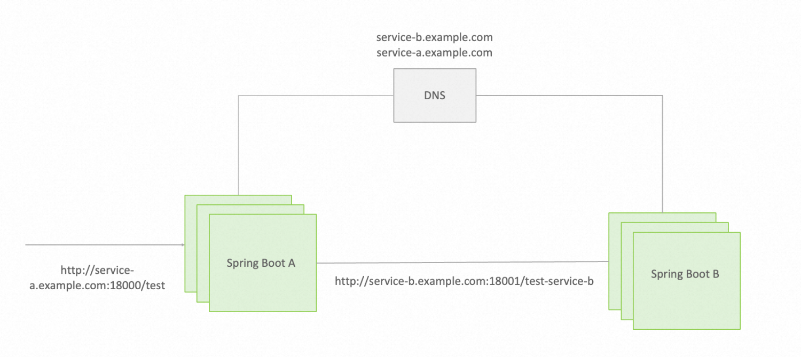

# Spring Boot 单体应用升级 Spring Cloud 微服务

通过以下示例，我们完整的演示了一个 Spring Boot 架构的单体应用集群，如何平滑的升级为一个 Spring Cloud 微服务集群，本文章包含源码、讲解、原理说明。

* 本示例完整源码，请参见 [Github 仓库](https://github.com/spring-cloud-alibaba-group/springboot-transfer-to-springcloud)
* 升级指南、版本选择、注意事项等，请参见[Spring Boot 迁移升级最佳实践](https://sca.aliyun.com/zh-cn/docs/next/best-practice/spring-boot-to-spring-cloud)

1. 原始 Spring Boot 应用架构

在示例中，我们有如下基于 Spring Boot 开发的应用架构：



我们这里列出来的只是一种示例架构。基于 Spring Boot 构建的应用架构变化多样，比如可能如下一些常用的架构，但不论哪种架构，升级 Spring Cloud 的大致改造方式都是类似的（都可以转为基于 Nacos 注册中心的地址发现与负载均衡）。

* 基于 DNS 自定义域名，服务间的通过域名调用实现负载均衡
* 基于 SLB 的中心化流量转发，调用直接转发到 SLB，由 SLB 实现在服务间实现流量转发
* 基于 Kubernetes Service 微服务体系，依赖 Kubernetes ClusterIP 等实现负载均衡与调用转发

2. 升级后的 Spring Cloud Alibaba 应用架构

我们将以上示例全部改造为 Spring Cloud 应用，改造后的架构如下：


新架构基于 Spring Cloud Service Discovery 机制实现地址自动发现与负载均衡，使用 Nacos 作为注册中心。

## 示例 Spring Boot 应用

示例包含 spring-boot-A（service-a） 和 spring-boot-B（service-b）两个应用（微服务），应用之间依赖 dns 域名完成互相调用。


因此，要完整的运行示例，我们首先需要在本地 `/etc/hosts` 配置域名映射：

```
127.0.0.1 service-b.example.com
127.0.0.1 service-a.example.com
```

依次启动 spring-boot-B（service-b）、spring-boot-A（service-a） 应用，使用以下命令验证应用正常工作：

```shell
$ curl http://service-a.example.com:18000/test
Get result from service B.
```

## 示例 Spring Cloud 应用


接下来，我们分步骤将 Spring Boot A 应用和 Spring Boot B 应用改造为 Spring Cloud 应用。

### 改造应用B

首先将 Spring Boot B 应用进行改造，接入 Spring Cloud Nacos Registry

#### 第一步：添加依赖

```xml
<properties>
    <spring-cloud-alibaba.version>2022.0.0.0</spring-cloud-alibaba.version>
    <spring-cloud.version>2022.0.0</spring-cloud.version>
</properties>
<dependencyManagement>
    <dependencies>
        <dependency>
            <groupId>org.springframework.cloud</groupId>
            <artifactId>spring-cloud-dependencies</artifactId>
            <version>${spring-cloud.version}</version>
            <type>pom</type>
            <scope>import</scope>
        </dependency>
        <dependency>
            <groupId>com.alibaba.cloud</groupId>
            <artifactId>spring-cloud-alibaba-dependencies</artifactId>
            <version>${spring-cloud-alibaba.version}</version>
            <type>pom</type>
            <scope>import</scope>
        </dependency>
    </dependencies>
</dependencyManagement>
<dependencies>
    <dependency>
        <groupId>com.alibaba.cloud</groupId>
        <artifactId>spring-cloud-starter-alibaba-nacos-discovery</artifactId>
    </dependency>
</dependencies>
```

#### 第二步：完善配置文件

```yaml
spring:
  application:
    name: service-b #项目名称必填，在注册中心唯一；最好和之前域名保持一致，第四步会讲到原因
  cloud:
    nacos:
      discovery: #启用 spring cloud nacos discovery
        server-addr: 127.0.0.1:8848
```

#### 第三步：启动类注解

```java
@SpringBootApplication
@EnableDiscoveryClient
public class SpringBootBApplication {
    public static void main(String[] args) {
        SpringApplication.run(SpringBootBApplication.class, args);
    }
}
```

### 改造应用A

#### 第一步：添加依赖

```xml
<properties>
    <spring-cloud-alibaba.version>2022.0.0.0</spring-cloud-alibaba.version>
    <spring-cloud.version>2022.0.0</spring-cloud.version>
</properties>
<dependencyManagement>
    <dependencies>
        <dependency>
            <groupId>org.springframework.cloud</groupId>
            <artifactId>spring-cloud-dependencies</artifactId>
            <version>${spring-cloud.version}</version>
            <type>pom</type>
            <scope>import</scope>
        </dependency>
        <dependency>
            <groupId>com.alibaba.cloud</groupId>
            <artifactId>spring-cloud-alibaba-dependencies</artifactId>
            <version>${spring-cloud-alibaba.version}</version>
            <type>pom</type>
            <scope>import</scope>
        </dependency>
    </dependencies>
</dependencyManagement>
<dependencies>
    <!-- Nacos 服务发现 -->
    <dependency>
        <groupId>com.alibaba.cloud</groupId>
        <artifactId>spring-cloud-starter-alibaba-nacos-discovery</artifactId>
    </dependency>
    <!-- 服务发现：OpenFeign服务调用 -->
    <dependency>
        <groupId>org.springframework.cloud</groupId>
        <artifactId>spring-cloud-starter-openfeign</artifactId>
    </dependency>
  <!-- 服务发现：负载均衡 -->
    <dependency>
        <groupId>org.springframework.cloud</groupId>
        <artifactId>spring-cloud-starter-loadbalancer</artifactId>
    </dependency>
</dependencies>
```

#### 第二步：配置文件

```yaml
spring:
  application:
    name: service-a #项目名称必填，在注册中心唯一；最好和之前域名保持一致，第四步会讲到原因
  cloud:
    nacos:
      discovery: #启用 spring cloud nacos discovery
        server-addr: 127.0.0.1:8848
```

#### 第三步：启动类注解

```java
@SpringBootApplication
@EnableDiscoveryClient
@EnableFeignClients
public class SpringBootAApplication {
    public static void main(String[] args) {
        SpringApplication.run(SpringBootAApplication.class, args);
    }
}
```

#### 第四步：调整调用方式

改造后的应用我们要使用 Nacos 注册中心来做地址发现，并使用 Loadbalancer 来实现负载均衡。

```java
@Bean
@LoadBalanced
public RestTemplate restTemplate() {
    return new RestTemplate();
}
```

```java
@RestController
public class AController {
	@Autowired
	private RestTemplate restTemplate;
	private static final String SERVICE_PROVIDER_ADDRESS = "http://service-b";

	@GetMapping("/test")
	public String callServiceB() {
		return restTemplate.getForObject(SERVICE_PROVIDER_ADDRESS +"/test-service-b", String.class);
	}
}
```

### 增加 Gateway 网关

#### 依赖

```xml
<properties>
    <spring-cloud-alibaba.version>2022.0.0.0</spring-cloud-alibaba.version>
    <spring-cloud.version>2022.0.0</spring-cloud.version>
</properties>
<dependencies>
    <dependency>
        <groupId>org.springframework.cloud</groupId>
        <artifactId>spring-cloud-starter-gateway</artifactId>
    </dependency>
    <!-- Nacos 服务发现 -->
    <dependency>
        <groupId>com.alibaba.cloud</groupId>
        <artifactId>spring-cloud-starter-alibaba-nacos-discovery</artifactId>
    </dependency>
    <!-- 服务发现：OpenFeign服务调用 -->
    <dependency>
        <groupId>org.springframework.cloud</groupId>
        <artifactId>spring-cloud-starter-openfeign</artifactId>
    </dependency>
    <!-- 整合nacos需要添加负载均衡依赖 -->
    <dependency>
        <groupId>org.springframework.cloud</groupId>
        <artifactId>spring-cloud-starter-loadbalancer</artifactId>
    </dependency>
</dependencies>
<dependencyManagement>
    <dependencies>
        <dependency>
            <groupId>org.springframework.cloud</groupId>
            <artifactId>spring-cloud-dependencies</artifactId>
            <version>${spring-cloud.version}</version>
            <type>pom</type>
            <scope>import</scope>
        </dependency>
        <dependency>
            <groupId>com.alibaba.cloud</groupId>
            <artifactId>spring-cloud-alibaba-dependencies</artifactId>
            <version>${spring-cloud-alibaba.version}</version>
            <type>pom</type>
            <scope>import</scope>
        </dependency>
    </dependencies>
</dependencyManagement>
```

#### 启动类注解

```java
@SpringBootApplication
@EnableDiscoveryClient
public class SpringGatewayApplication {
    public static void main(String[] args) {
        SpringApplication.run(SpringGatewayApplication.class, args);
    }
}
```

#### 路由配置

```yaml
spring:
  cloud:
    gateway:
      routes:
        - id: service-a
          uri: lb://service-a
          predicates:
            - Path=/service-a/test/**
          filters:
            - StripPrefix=1

        - id: service-b
          uri: lb://service-b
          predicates:
            - Path=/service-b/test-service-b/**
          filters:
            - StripPrefix=1
```

### 启动与验证

在本地 `/etc/hosts` 配置如下 hostname 映射

```shell
127.0.0.1  service.example.com
```

依次启动 A、B、Gateway 三个应用。

访问：`http://service.example.com/service-a/test-servicer-b`

可以看到，请求正常被转发到 service-a、service-b，并实现多实例地址自动发现、负载均衡。
