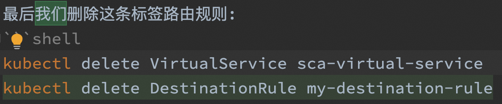
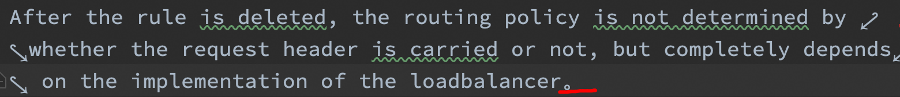
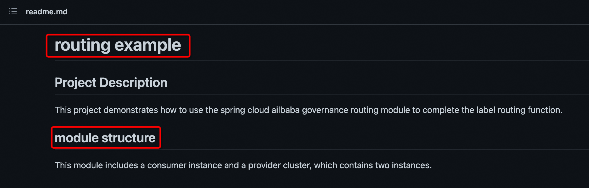
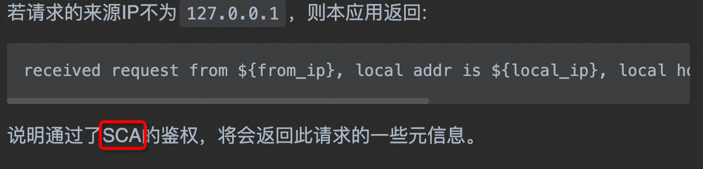
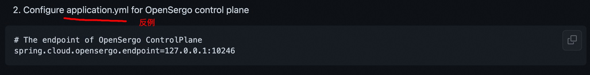

1. 正式书面文档不要用我们，xxx等人称：

2. 一句话说完了，需要添加合适的标点符号：

3. 注意专有名词，spring cloud->Spring Cloud、feign->Feign、nacos->Nacos等等，不知道专有名词请拿相关关键字在搜索引擎中检索，看一般这个单词的大小写形式如何。有些单词需要分开写DestinationRule->Destination Rule。另外英文需要注意词性，标题不要使用动词，一般为名词。

4. 模块标题英文注意首字母大写

5. 修饰符，不同的内容需要适应对应的类型：

6. 缩略词还是尽量使用前先声明，比如Spring Cloud Alibaba（后文简称SCA）,不要什么都不说就直接用一些外人不太熟悉的缩略词：

7. 关键内容，比如特定配置文件、依赖名称需要使用阴影标记：

8. 需要回答几个问题，你的功能作用域是什么，就是做到了什么地步？
9. 你的功能用户使用过程中哪些步骤容易犯错，注意提前提醒？
10. 最后，写完以后自己至少读一遍，否则大概率有问题！否则大概率有问题！否则大概率有问题！
